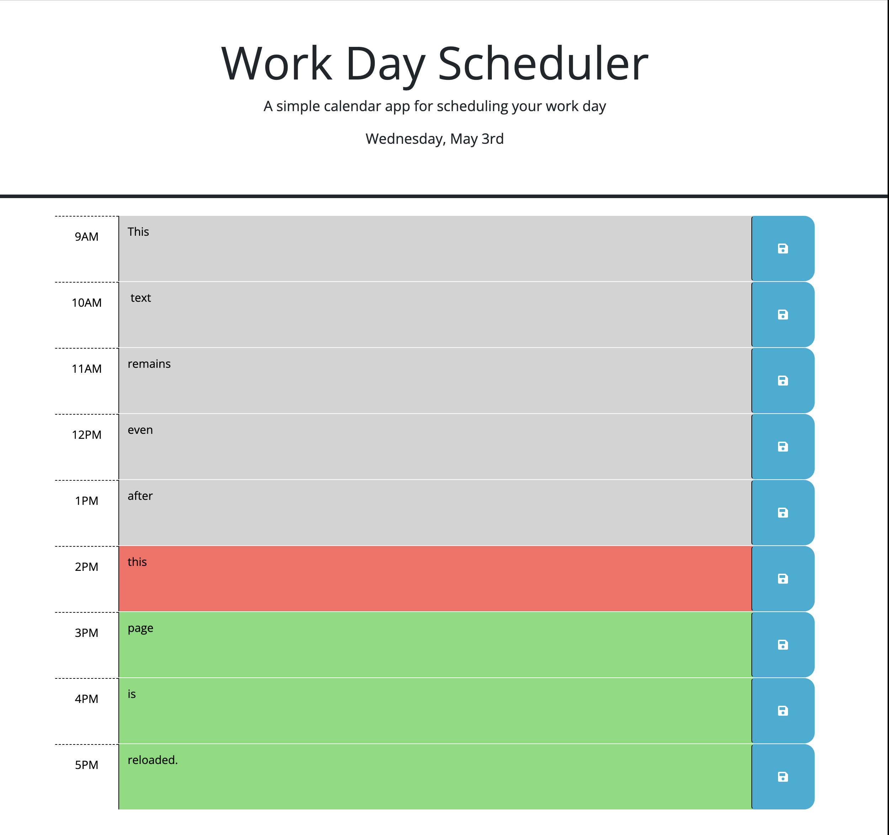

This repository contains files relating to the Work Day Scheduler. I have satisfied the acceptance criteria in the following manner...
• When opened, the planner displays the current day at the top of the calendar.
• When the user scrolls down, they are presented with timeblocks for standard business hours.
• When the user views timeblocks for that day, each is color-coded to indicate whether that time is in the past, present, or future.
• When the timbeblock is clicked into, the user can enter an event.
• When the user clicks the save button for that timeblock, text for that event is saved in local storage.
• When the user refreshes the page, the saved events persist.

• Here is a screenshot of the 'Scheduler'...

• Here is a link to deployed 'Scheduler': https://kpl33.github.io/work_day_scheduler/